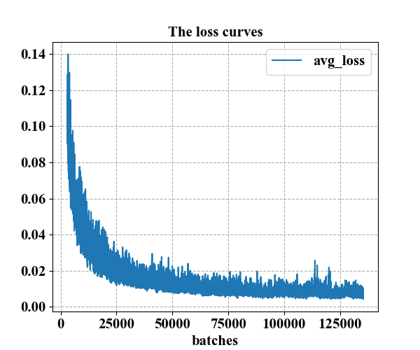

# Pedestrian Detection YOLOv3 in INRIA

* [Pedestrian Detection YOLOv3 in INRIA](#pedestrian-detection-yolov3-in-inria)
    * [Introduction](#introduction)
    * [Dataset](#dataset)
    * [Workflow](#workflow)
        * [1\. prepare Darknet](#1-prepare-darknet)
            * [1\.1\. download Darknet](#11-download-darknet)
            * [1\.2\. change Makefile](#12-change-makefile)
            * [1\.3\. Compile the source code](#13-compile-the-source-code)
        * [2\. Training YOLOv3](#2training-yolov3)
            * [2\.1\. make YOLO data](#21-make-yolo-data)
            * [2\.2\. take YOLO label](#22-take-yolo-label)
            * [2\.3\. Make the list files needed for Darknet](#23-make-the-list-files-needed-for-darknet)
            * [2\.4\. some configuration before training(Darknet need)](#24-some-configuration-before-trainingdarknet-need)
                * [\./cfg/yolo\-inria\.cfg](#cfgyolo-inriacfg)
                * [\./data/inria\.names](#datainrianames)
                * [\./data/inria\.data](#datainriadata)
            * [2\.5\. Download the pretraining weights](#25-download-the-pretraining-weights)
            * [2\.6\. Training YOLO in INRIA](#26-training-yolo-in-inria)
            * [2\.7\. loss curve plot](#27-loss-curve-plot)
        * [3\. Evaluate Detector](#3-evaluate-detector)
            * [3\.1\. get Ground Truth](#31-get-ground-truth)
            * [3\.2 predict bounding\_boxes](#32-predict-bounding_boxes)
            * [3\.3 Evaluate the detector](#33-evaluate-the-detector)
    * [Result](#result)

## Introduction

Pedestrian Detection using YOLOv3 based on Darknet in INRIA. For YOLO detector's predict bounding-boxes, apply NMS(non-maximum suppression) to remove redundant and overlapping bounding boxes.

For the model I trained, I push it on `pan.baidu.com` and `drive.google.com`, it's a weight that has been trained 1.3 million times.(234.9M)

Download link:

1. Baidu Cloud Disk(中文) : [https://pan.baidu.com/s/1kDJqaa6NeWalzxzOhnorrQ](https://pan.baidu.com/s/1kDJqaa6NeWalzxzOhnorrQ) password: zwku

2. Google Drive : [https://drive.google.com/file/d/1MXOqmZH7OtUpNWu60GBgxpkikgfc70My/view?usp=sharing](https://drive.google.com/file/d/1MXOqmZH7OtUpNWu60GBgxpkikgfc70My/view?usp=sharing)


## Dataset

INRIA Person Dataset link:

1. ~~official link : [http://pascal.inrialpes.fr/data/human/](http://pascal.inrialpes.fr/data/human/)~~ down

2. Baidu Cloud Disk(中文) : [https://pan.baidu.com/s/12TYw-8U9sxz9cUu2vxzvGQ](https://pan.baidu.com/s/12TYw-8U9sxz9cUu2vxzvGQ) password: jxqu

2. Google Drive : [https://drive.google.com/file/d/1wTxod2BhY_HUkEdDYRVSuw-nDuqrgCu7/view?usp=sharing](https://drive.google.com/file/d/1wTxod2BhY_HUkEdDYRVSuw-nDuqrgCu7/view?usp=sharing)

## Workflow

Here is my workflow including prepare Darknet in Ubuntu | train YOLO v3 in INRIA | evaluate the trained YOLO detector.

**NOTE:** All python files need to be run **separately**.


### 1. prepare Darknet

#### 1.1. download Darknet
```bash
git clone https://github.com/pjreddie/darknet
```

#### 1.2. change Makefile
for me:
```makefile
GPU=1
CUDNN=1
OPENCV=1
```

#### 1.3. Compile the source code
```bash
make
```

### 2. Training YOLOv3

#### 2.1. make YOLO data

Copy (./INRIAPerson/Train and /Test)'s image(include /pos /neg) to a new folder(./data/)

After run The following command, you can get file structure:

- ./data
    - /Train -- 1832 images
    - /Test -- 741 images
```bash
python ./make_YOLO_data(YOLO_data).py
```

#### 2.2. take YOLO label

For the '/pos' of the original data set, use the regular expression to read the Ground Truth information of each image.

In the annotation, for each target of each image, its real bounding box(Ground Truth) is expressed by 4 int, which are `(Xmin, Ymin) - (Xmax, Ymax)`.

The label used for training needs to be stored in TXT file with the same name as the image, and all the Ground Truth in a image must store in a TXT file, one per line, format:`<object-class> <x> <y> <width> <height>`
where x, y, width, and height are relative to the image's width and height, and object-class is all 0.

```bash
python ./take_YOLO_label(YOLO_data).py
```

**PS:** The labels file for each image in yolov3 must be in the **same directory** as the image, otherwise you will be told during training that cannot find the labels file.

#### 2.3. Make the list files needed for Darknet

Darknet needs a TXT file that lists the paths of all images to be trained and tested.

```bash
python ./Darknet_list_image_files(.txt).py
```

#### 2.4. some configuration before training(Darknet need)

##### ./cfg/yolo-inria.cfg

Copy yolov3.cfg to ./cfg/yolo-inria.cfg and modify all classes to 1 and change the number of convolutional cores(filters) of all the last layers (that is, the [convolutional] layer before the [yolo] layer) to 18. It's computed by 3*(5+classes)=18(classes=1).

##### ./data/inria.names

Create inria.names, a file where each line is a class name, so just fill in one line: person.

##### ./data/inria.data

Copy coco.data to ./data/inria.data and change classes to 1 and fill in the path of previously processed list file and the path of inria.names and set up the model save path(./backup) as shown below.

```txt
classes= 1
train  = data/Train.txt
valid  = data/Test.txt
names  = data/inria.names
backup = backup/
```

#### 2.5. Download the pretraining weights

```bash
wget https://pjreddie.com/media/files/darknet53.conv.74
```

#### 2.6. Training YOLO in INRIA

Copy Darknet's executable file(darknet) to this folder. Then let's training. Don't forget save log!

```bash
./darknet detector train data/inria.data cfg/yolo-inria.cfg darknet53.conv.74 | tee training.log
```

#### 2.7. loss curve plot

Extract the log of loss and draw the log curve, but there is nan in loss, get rid of nan. So, extract the training log, remove the non-parsed log and format the log file to generate a new log file for python visual script drawing. And then Draw the loss curve.

```bash
python ./extract_log.py
python ./visualization_loss.py
```

### 3. Evaluate Detector

#### 3.1. get Ground Truth

Using regular expressions to get the Ground_Truth from the annotation.

```bash
python ./get_ground_truth(annotation2Ground_Truth.npy).py
```

#### 3.2 predict bounding_boxes

Using YOLO_detector predict Pedestrian's bounding_boxes in ./data/Test/ which is got by 2.1.

```bash
python ./predict_bounding_boxes(predict).py
```

#### 3.3 Evaluate the detector

Using (predict bounding_boxes and Ground_Truth)'s IOU > 0.5 is good to evaluate the detector

```bash
python ./evaluate_the_detector.py
```

**PS:** detect_bounding_boxes.py provides the detector method(don't need to run)


## Result

Here are some results to share.

For training model, loss curve plot as follows, it's 3000 to 135249 because it start with a high loss.



Using (predict bounding_boxes and Ground_Truth)'s IOU > 0.5 is good to evaluate the detector. There are 589 Ground Truth and predictions bounding_boxes number is 477 and the number of correct prediction is 474. Finally, precision and recall and so on as shown in the following table.

| Precision | Recall | False Positive Rate | Miss Rate |
|-----------|--------|---------------------|-----------|
| 99.37%    | 80.48% | 0.63%               | 19.52%    |

The detection effect of pedestrian detection based on YOLO v3 is very nice, the detection rate (recall rate) of pedestrian detection is very high, and the precision ratio reaches 99.37%, almost all  predict bounding_boxes are right.